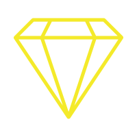

### Hi there 👋

## About Me
- I'm a frontend engineer at 极客学院

- I love coding, and familiar with 
-  Master degree @ UNSW, and Bachelor degree @ ZSTU

- Experienced at web, h5, wechat miniprogram,data visualization

- I also have some experiences at Microservices with nodejs

